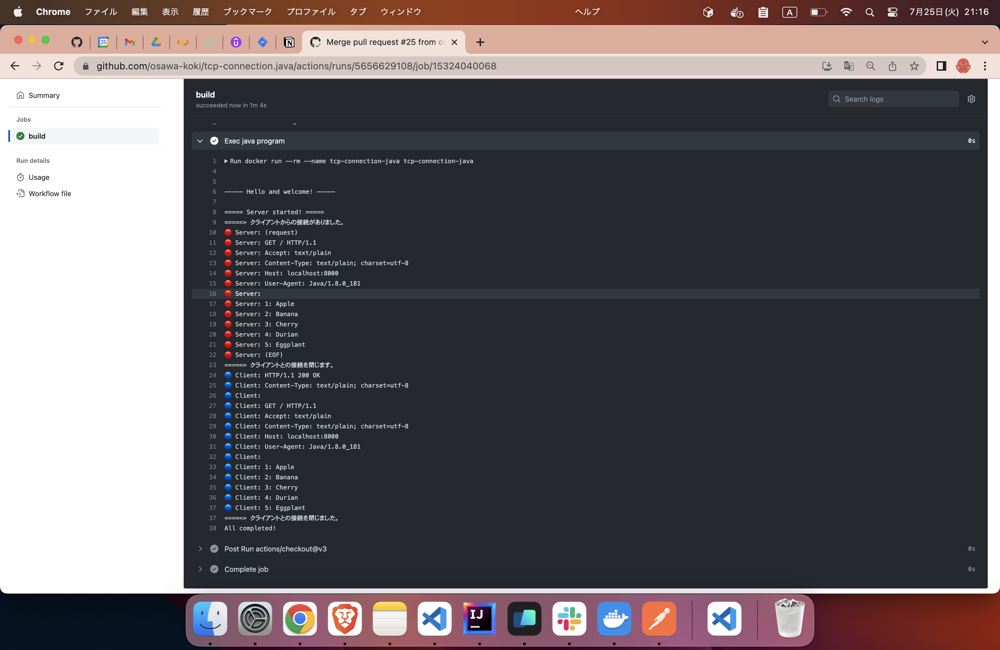

# tcp-connection.java

👅👅👅 JavaでTCPクライアントとTCPサーバを実装して、通信してみる！  

  

  

## 実行方法

```shell
docker build -t tcp-connection-java .
docker run -it --rm --name tcp-connection-java tcp-connection-java
```
